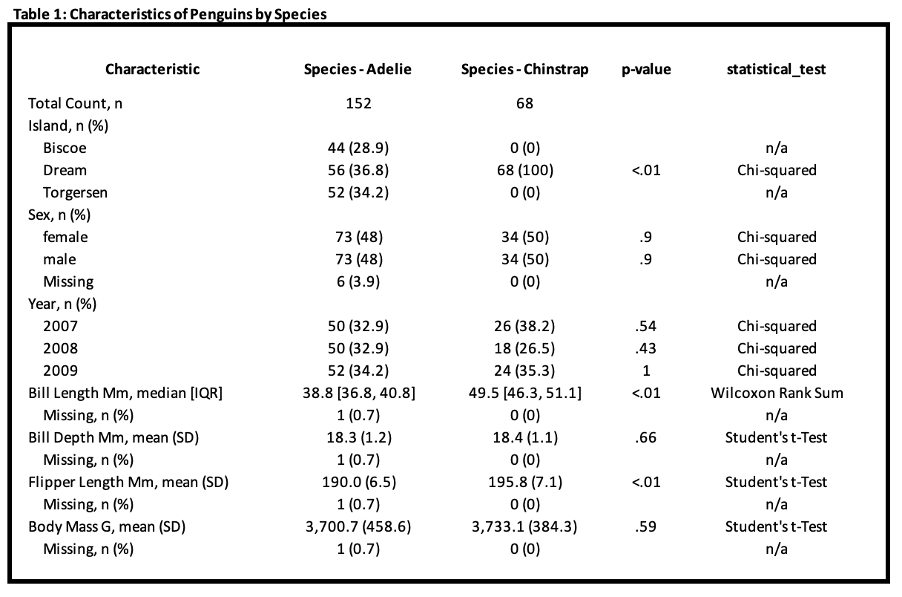

<!-- README.md is generated from README.Rmd. Please edit that file -->

```{r, include = FALSE}
knitr::opts_chunk$set(
  collapse = TRUE,
  comment = "#>",
  fig.path = "man/figures/README-",
  out.width = "100%"
)
```

# quickstats

<!-- badges: start -->
<!-- badges: end -->

The goal of quickstats is to simply and statistically compare columns by group and output the results in a publication-ready table. 

## Installation

You can install the development version of quickstats from [GitHub](https://github.com/) with:

``` r
# install.packages("devtools")
devtools::install_github("jtmenchaca/quickstats")
```

## Create a comparison

```{r example}
library(quickstats)
library(dplyr, quietly = T, warn.conflicts = F)

data(iris)
summary = iris |>
  compare_cols_by_group(
    group_col = "Species",
    continuous_cols = c("Sepal.Length", "Sepal.Width", "Petal.Length", "Petal.Width"),
    rounding_digits = 1
  )


data(mtcars)
summary = mtcars |>
  compare_cols_by_group(
    group_col = "cyl",
    binary_or_cat_cols = c("vs", "am", "gear", "carb"),
    continuous_cols = c("mpg", "disp", "hp", "drat", "wt", "qsec")
  )

```

By default, the binary/categorical columns are compared across groups using the Fisher's Exact test.  If the data is too large to be run efficiently using the standard Fisher's Exact test, comparisons will be made using the Monte Carlo variant for Fisher's.

```{r}
mtcars |>
  compare_cols_by_group(
    group_col = "cyl",
    binary_or_cat_cols = c("gear", "carb")
  )
```

Continuous columns are compared between two groups by either 1) the Student's t-test if the column has a normal distribution or 2) the Wilcoxon signed-rank test if the distribution is non-normal. The Shapiro–Wilk test is used to evaluate normality.

When comparing between three groups, the ANOVA test is used to compare continuous columns.

If a continuous variable has a non-normal distribution by the Shaprio-Wilk test, it is summarized using IQR.

```{r}
mtcars |>  
  compare_cols_by_group(
    group_col = "cyl", 
    continuous_cols = c("mpg", "disp", "hp")
  )
```

Use the `remove_group_col_NA` and `cols_to_remove_NA` to remove rows with missing values in specific columns. 

Sometimes, you want to use a subset of your dataset to compare across groups for your binary/categorical data.  To specify the column you would like to use as a subset, use the `binary_or_cat_cols_subpop` argument. 

If the `binary_or_cat_cols_subpop` argument is provided, it must be the same length as the `binary_or_cat_cols` argument where each value in `binary_or_cat_cols` aligns by index to the value in the `binary_or_cat_cols_subgroup`.  Columns that should use the general population should have a value of the empty string "".  

For now, any columns specified in `binary_or_cat_cols_subpop` should be binary columns, where a value of `1` will be used to identify the appropriate subpopulation. 

## Save your results to Excel

Neatly translate your formatted results to an XLSX file with the helper function `save_comparison_to_xlsx`.

```{r}
mtcars |>  
  compare_cols_by_group(
    group_col = "cyl", 
    continuous_cols = c("mpg", "disp", "hp")
  ) |>
   save_comparison_to_xlsx(
     file_name = "Comparison.xlsx",
     title = "Table 1: Outcomes in Population by Group"
  )
```

It should leave you with a tidy XLSX file with something that looks like the following: 


*J.T. Menchaca*
