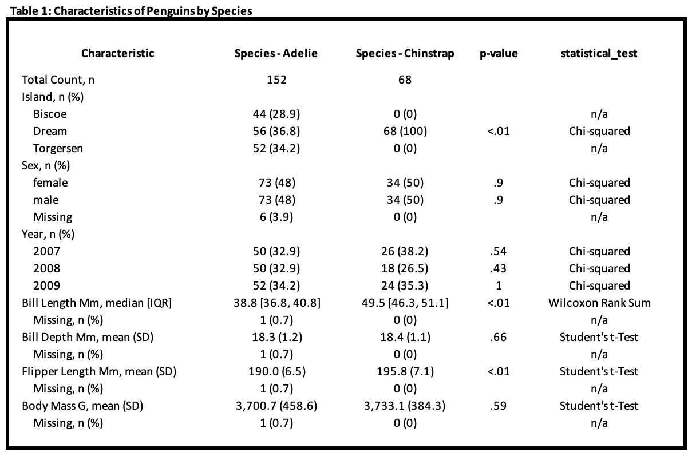

<!-- README.md is generated from README.Rmd. Please edit that file -->

# quickstats

<!-- badges: start -->
<!-- badges: end -->

The goal of quickstats is to simply and statistically compare columns by
group and output the results in a publication-ready table.

## Installation

You can install the development version of quickstats from
[GitHub](https://github.com/) with:

``` r
# install.packages("devtools")
devtools::install_github("jtmenchaca/quickstats")
```

## Create a comparison

``` r
library(quickstats)
library(dplyr, quietly = T, warn.conflicts = F)

data(iris)
summary = iris |>
  compare_cols_by_group(
    group_col = "Species",
    continuous_cols = c("Sepal.Length", "Sepal.Width", "Petal.Length", "Petal.Width"),
    rounding_digits = 1
  )


data(mtcars)
summary = mtcars |>
  compare_cols_by_group(
    group_col = "cyl",
    binary_or_cat_cols = c("vs", "am", "gear", "carb"),
    continuous_cols = c("mpg", "disp", "hp", "drat", "wt", "qsec")
  )
```

By default, the binary/categorical columns are compared across groups
using the Fisher’s Exact test. If the data is too large to be run
efficiently using the standard Fisher’s Exact test, comparisons will be
made using the Monte Carlo variant for Fisher’s.

``` r
mtcars |>
  compare_cols_by_group(
    group_col = "cyl",
    binary_or_cat_cols = c("gear", "carb")
  )
#> # A tibble: 12 × 6
#>    Characteristic   `Cyl - 4`  `Cyl - 6`  `Cyl - 8`   `p-value` statistical_test
#>    <chr>            <chr>      <chr>      <chr>       <chr>     <chr>           
#>  1 "Total Count, n" "11"       "7"        "14"        ""        ""              
#>  2 "Gear, n (%)"    ""         ""         ""          ""        ""              
#>  3 "     3"         "1 (9.1)"  "2 (28.6)" "12 (85.7)" "<.01"    "Fisher's Exact"
#>  4 "     4"         "8 (72.7)" "4 (57.1)" "0 (0)"     "<.01"    "Fisher's Exact"
#>  5 "     5"         "2 (18.2)" "1 (14.3)" "2 (14.3)"  "1"       "Fisher's Exact"
#>  6 "Carb, n (%)"    ""         ""         ""          ""        ""              
#>  7 "     1"         "5 (45.5)" "2 (28.6)" "0 (0)"     ".01"     "Fisher's Exact"
#>  8 "     2"         "6 (54.5)" "0 (0)"    "4 (28.6)"  ".05"     "Fisher's Exact"
#>  9 "     3"         "0 (0)"    "0 (0)"    "3 (21.4)"  ".22"     "Fisher's Exact"
#> 10 "     4"         "0 (0)"    "4 (57.1)" "6 (42.9)"  ".01"     "Fisher's Exact"
#> 11 "     6"         "0 (0)"    "1 (14.3)" "0 (0)"     ".22"     "Fisher's Exact"
#> 12 "     8"         "0 (0)"    "0 (0)"    "1 (7.1)"   "1"       "Fisher's Exact"
```

Continuous columns are compared between two groups by either 1) the
Student’s t-test if the column has a normal distribution or 2) the
Wilcoxon signed-rank test if the distribution is non-normal. The
Shapiro–Wilk test is used to evaluate normality.

When comparing between three groups, the ANOVA test is used to compare
continuous columns.

If a continuous variable has a non-normal distribution by the
Shaprio-Wilk test, it is summarized using IQR.

``` r
mtcars |>  
  compare_cols_by_group(
    group_col = "cyl", 
    continuous_cols = c("mpg", "disp", "hp")
  )
#> # A tibble: 4 × 6
#>   Characteristic     `Cyl - 4`           `Cyl - 6`       Cyl -…¹ p-val…² stati…³
#>   <chr>              <chr>               <chr>           <chr>   <chr>   <chr>  
#> 1 Total Count, n     11                  7               14      ""      ""     
#> 2 Mpg, mean (SD)     26.7 (4.5)          19.7 (1.5)      15.1 (… "<.01"  "ANOVA"
#> 3 Disp, median [IQR] 108.0 [78.8, 120.7] 167.6 [160.0, … 350.5 … "<.01"  "ANOVA"
#> 4 Hp, median [IQR]   91.0 [65.5, 96.0]   110.0 [110.0, … 192.5 … "<.01"  "ANOVA"
#> # … with abbreviated variable names ¹​`Cyl - 8`, ²​`p-value`, ³​statistical_test
```

Use the `remove_group_col_NA` and `cols_to_remove_NA` to remove rows
with missing values in specific columns.

Sometimes, you want to use a subset of your dataset to compare across
groups for your binary/categorical data. To specify the column you would
like to use as a subset, use the `binary_or_cat_cols_subpop` argument.

If the `binary_or_cat_cols_subpop` argument is provided, it must be the
same length as the `binary_or_cat_cols` argument where each value in
`binary_or_cat_cols` aligns by index to the value in the
`binary_or_cat_cols_subgroup`. Columns that should use the general
population should have a value of the empty string ““.

For now, any columns specified in `binary_or_cat_cols_subpop` should be
binary columns, where a value of `1` will be used to identify the
appropriate subpopulation.

## Save your results to Excel

Neatly translate your formatted results to an XLSX file with the helper
function `save_comparison_to_xlsx`.

``` r
mtcars |>  
  compare_cols_by_group(
    group_col = "cyl", 
    continuous_cols = c("mpg", "disp", "hp")
  ) |>
   save_comparison_to_xlsx(
     file_name = "Comparison.xlsx",
     title = "Table 1: Outcomes in Population by Group"
  )
#> # A tibble: 4 × 6
#>   Characteristic     `Cyl - 4`           `Cyl - 6`       Cyl -…¹ p-val…² stati…³
#>   <chr>              <chr>               <chr>           <chr>   <chr>   <chr>  
#> 1 Total Count, n     11                  7               14      ""      ""     
#> 2 Mpg, mean (SD)     26.7 (4.5)          19.7 (1.5)      15.1 (… "<.01"  "ANOVA"
#> 3 Disp, median [IQR] 108.0 [78.8, 120.7] 167.6 [160.0, … 350.5 … "<.01"  "ANOVA"
#> 4 Hp, median [IQR]   91.0 [65.5, 96.0]   110.0 [110.0, … 192.5 … "<.01"  "ANOVA"
#> # … with abbreviated variable names ¹​`Cyl - 8`, ²​`p-value`, ³​statistical_test
```

It should leave you with a tidy XLSX file with something that looks like
the following: 

*J.T. Menchaca*
